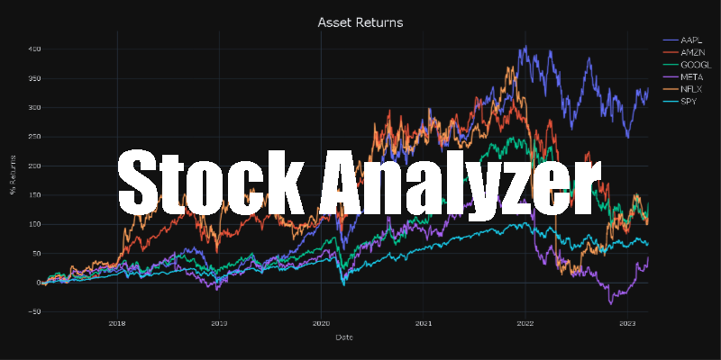

     

# Background
This repository is for a personal python library I built for analyzing stock and stock portfolio data.  It is built using OOP methods based on the yfinance and plotly libraries.  It is broken up into two modules: Assets and Portfolio.  Assets, is for the analysis of a stock or group of stocks while Portfolio is for the analysis of a group of stocks weighted in a portfolio.  There are different calculations and visualizations included in this library to save time with data analysis, but keep in mind this was built for my personal use and it is not meant to be a production level library. 

# What it's good For:
This library is good for exploratory data analysis of stocks.  It is meant to save time plotting and calculating standard operations in a format that suits _my_ preferences. You can analyze up-to-date historical data of any stock listed on yahoo finance.

# What it isn't good for:
This library isn't built for realtime data analysis, portfolio optimization (yet), backtesting trading algorithms (trading in general), etc.

# What can it do?
As mentioned earlier there are two modules: Asset and Portfolio.  Below you can see a breakdown of the functions/capabilities in both, including some overlap.

## Asset
- Data Gather
- Simple Returns
- Log Returns
- Mean Returns
- Standard Deviaton of Returns (Volatility)
- Closing Price Plotting
- Returns Plotting
- Candlestick Plotting w/moving averages

## Portfolio
- Data Gather
- Simple Returns
- Log Returns
- Portfolio Returns
- Closing Price Plotting
- Returns Plotting
- Covariance Matrix w/heatmap
- Correlation Matrix w/heatmap
- Portfolio Standard Deviation
- Risk / Return Plot
- Portfolio Pie Plot

# Getting Started
After downloading/importing the modules you will need to download stock data for your analysis. To do this you need to provide of list of stock tickers and a start date. Providing an end date is optional and if left blank it will default to today. See the code below:

     

This format will work for initializing both you Asset and Portfolio classes, because you can analyze multiple stocks in Asset, it just wont include weights:

     

The whole idea of the Portfolio module is to have analyze weighted portfolio, and not just a group of stocks. So how do we do that? To add weights you must define an array of weights respective to your list of ticker symbols. Your weights must add up to 1. See the code below:

     

However, adding weights is an optional argument for initializing a Portfolio class.  This is because I thought it might be tedious to have to change the weights everytime I added or removed a stock.  So if you decide to not define weights, it will automatically assign weights summing to one using the function below:

     

Once you have you class initialized you can start your analysis.

